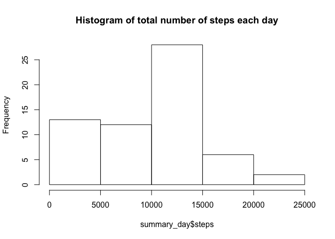
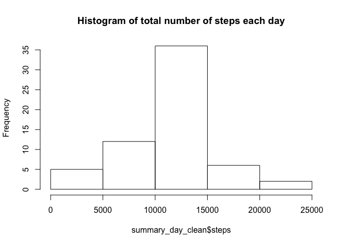
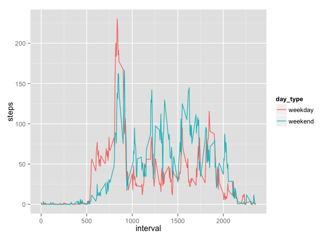

# Reproducible Research: Peer Assessment 1
## Import neccessary packages (dplyr and ggplot2)

```r
##Loading packages
library(dplyr)
```

```
## 
## Attaching package: 'dplyr'
## 
## The following objects are masked from 'package:stats':
## 
##     filter, lag
## 
## The following objects are masked from 'package:base':
## 
##     intersect, setdiff, setequal, union
```

```r
library(ggplot2)
```

## Loading and preprocessing the data

```r
activity <- read.csv('activity.csv')
activity$date <- as.Date(activity$date)
```

## What is mean total number of steps taken per day?
1. Calculate the total number of steps taken per day

```r
summary_day <- activity %>% group_by(date) %>% summarise(steps = sum(steps, na.rm = TRUE))
```

2. Histogram of the total number of steps taken each day

```r
hist(summary_day$steps, main = "Histogram of total number of steps each day")
```

 

3. Calculate and report the mean and median of the total number of steps taken per day

```r
mean(summary_day$steps)
```

```
## [1] 9354.23
```

```r
median(summary_day$steps)
```

```
## [1] 10395
```

## What is the average daily activity pattern?

```r
summary_interval = activity %>% group_by(interval) %>% summarise(steps = mean(steps, na.rm = TRUE))
```
1. Time series plot of avarage number of steps taken in 5 minute interval

```r
qplot(interval, steps, data = summary_interval, geom='line')
```

 


2. Interval that contains the maximum number of steps

```r
summary_interval[which.max(summary_interval$steps), 1]
```

```
## Source: local data frame [1 x 1]
## 
##   interval
##      (int)
## 1      835
```
## Imputing missing values
1. Number of missing values

```r
nrow(filter(activity, is.na(steps)))
```

```
## [1] 2304
```
2. Filling in the missing values by using the mean of the 5-minute interval across all days

```r
activity_clean <- left_join(activity, summary_interval, by = 'interval')
activity_clean <- mutate(activity_clean, steps = ifelse(is.na(steps.x), steps.y, steps.x))
```
3. Create a new dataset that is equal to the original dataset but with the missing data filled in.

```r
activity_clean <- subset(activity_clean, select = c(steps, date, interval))
```

4. Histogram of the total number of steps taken each day

```r
summary_day_clean <- activity_clean %>% group_by(date) %>% summarise(steps = sum(steps))
hist(summary_day_clean$steps, main = "Histogram of total number of steps each day")
```

 

```r
###Mean total number of steps each day
mean(summary_day_clean$steps)
```

```
## [1] 10766.19
```

```r
###Median total number of steps each day
median(summary_day_clean$steps)
```

```
## [1] 10766.19
```

We can see that by imputing  missing data we increase the mean of total daily number of steps.

## Are there differences in activity patterns between weekdays and weekends?
1. Create a new factor  variable in the dataset (named day_type) with two levels:  "weekday" and "weekend"" indicating whether a given date is a weekday or weekend day.

```r
activity_clean <- mutate(activity_clean, day_type = ifelse(weekdays(activity_clean$date) %in% c('Saturday', 'Sunday'), 'weekend', 'weekday'))
```

2. Make a panel plot containing a time series plot (i.e. type = "l") of the 5-minute interval (x-axis) and the average number of steps taken, averaged across all weekday days or weekend days (y-axis).

```r
summary_interval_clean = activity_clean %>% group_by(interval, day_type) %>% summarise(steps = mean(steps))
ggplot(data = summary_interval_clean, aes(interval, steps, color = day_type)) + geom_line() 
```

 


So we can see that there are differences in activity between weekdays and weekends: in weekend there is less activity in the early morning (7 - 8am), but more activity around the late morning until afternoon time.

